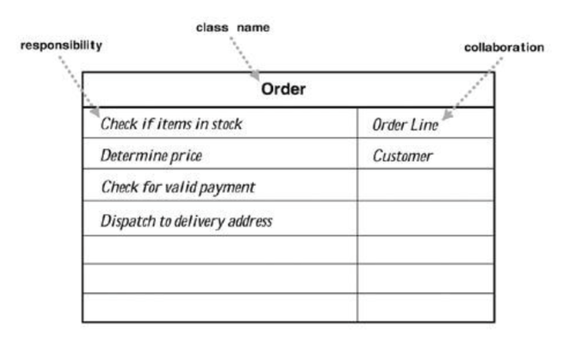

# Cell Society Design Lab Discussion
#### Noah Loewy (nl190), Alisha Zhang (xz352), Judy He (yh381)


### Simulations


### Simulations
Conways Game of Life
Forest Fire
Schelling’s Model of Segregation

* Commonalities

All cells on a very large grid
All related to real world
All look at neighbors in some aspect

* Variations

Sterlings has different types of cells, whereas Life has one type.

Life is infinite grid, whereas others are on a finite grid

Conway’s has fixed rules, whereas the others are parameterized.

### Discussion Questions

* How does a Cell know what rules to apply for its simulation?

The cell knows what rules to apply for its simulation based on a few factors. First, it depends on the variation/type of simulation it is using, and the pre-configured rules of that simulation. Second, it depends on the status of its neighboring cells.

* How does a Cell know about its neighbors?

If we structure the cells in the form of a two dimensional array or matrix, we are able to examine neighboring cells by indexing the two dimensional matrix.

* How can a Cell update itself without affecting its neighbors update?

There are multiple ways a cell can update itself without affecting its neighbors. One possible solution is for each cell to hold two values, a “current-status” and a “post-update-status”. This will allow for the updates to occur simultaneously.

* What behaviors does the Grid itself have?

One behavior that the grid has is updating the cells. Another is beginning the simulation, as well as ending the simulation.  We are a little confused on what this question is referring to when it says “the grid”

* How can a Grid update all the Cells it contains?

A grid can update all of its cells by looping through each cells, checking the amount of alive neighbors it has, and updating the “post-update” field of that cell to alive or dead. .

* What information about a simulation needs to be in the configuration file?

There are numerous pieces of information that would be best suited to be in the configuration file, to avoid having to define tons of “magic constants” at the top of each file. This includes how frequent the updates should occur, how large the grid-displayed should be, which version of the simulation to do, and many more.

* How is configuration information used to set up a simulation?

Configuration can be used to set up a simulation by determining certain settings for the simulation, such as the original configuration, update time, and more. It can also be helped to set up by putting certain cells in different places, for example,

* How is the graphical view of the simulation updated after all the cells have been updated?


Once the values of the cells are updated, the graphical view can be updated by looping through all of the cells, and then displaying all the alive ones as one color, and all the dead ones as another color.


### Alternate Designs

#### Design Idea #1

* 2d ArrayList of Integers and XML File

* Data Structure #2 and File Format #2


#### Design Idea #2

* Data Structure #1 and File Format #1

* Data Structure #2 and File Format #2


### High Level Design Goals


### CRC Card Classes

This class's purpose or value is to represent a customer's order:



This class's purpose or value is to represent a customer's order:

|Order| |
|---|---|
|boolean isInStock(OrderLine)         |OrderLine|
|double getTotalPrice(OrderLine)      |Customer|
|boolean isValidPayment (Customer)    | |
|void deliverTo (OrderLine, Customer) | |


This class's purpose or value is to represent a customer's order:
```java
public class Order {
    // returns whether or not the given items are available to order
    public boolean isInStock (OrderLine items)
    // sums the price of all the given items
    public double getTotalPrice (OrderLine items)
    // returns whether or not the customer's payment is valid
    public boolean isValidPayment (Customer customer)
    // dispatches the items to be ordered to the customer's selected address
    public void deliverTo (OrderLine items, Customer customer)
}
 ```


This class's purpose or value is to manage something:
```java
public class Something {
    // sums the numbers in the given data
    public int getTotal (Collection<Integer> data)
    // creates an order from the given data
    public Order makeOrder (String structuredData)
}
```


### Use Cases

* Apply the rules to a middle cell: set the next state of a cell to dead by counting its number of neighbors using the Game of Life rules for a cell in the middle (i.e., with all its neighbors)
```java
 Something thing = new Something();
Order o = thing.makeOrder("coffee,large,black");
 o.update(13);
```

* Apply the rules to an edge cell: set the next state of a cell to live by counting its number of neighbors using the Game of Life rules for a cell on the edge (i.e., with some of its neighbors missing)
```java
 Something thing = new Something();
Order o = thing.makeOrder("coffee,large,black");
 o.update(13);
```

* Move to the next generation: update all cells in a simulation from their current state to their next state and display the result graphically
```java
 Something thing = new Something();
Order o = thing.makeOrder("coffee,large,black");
 o.update(13);
```

* Set a simulation parameter: set the value of a parameter, probCatch, for a simulation, Fire, based on the value given in a data file
```java
 Something thing = new Something();
Order o = thing.makeOrder("coffee,large,black");
 o.update(13);
```