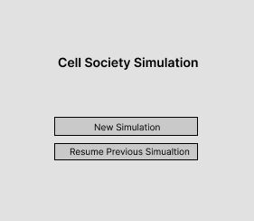
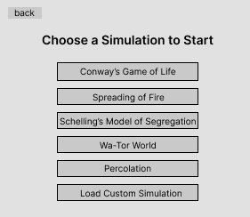
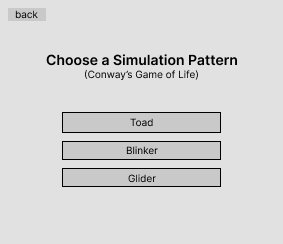
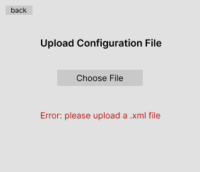
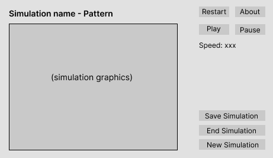
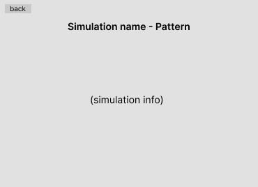
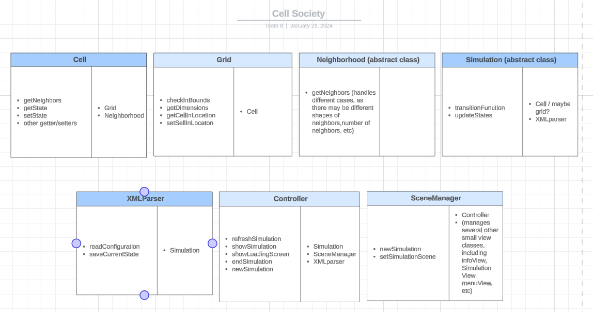

# Cell Society Design Plan

### Team 8

### Judy He, Noah Loewy, Alisha Zhang

## Overview

In our program, we hope to model 5 different kinds of Cellular Automata (CA). In the Cell Society
project, we hope that our final implementation of our code, we will be able to model any form of
Cellular Automata relatively easily, regardless of any transition functions, parameters, or use
cases. We hope to do this by writing generalizable, extendable, and modular code, as we have
discussed in CS308.

On a higher level, we hope to break down our code into three different sections. The model section
of our codebase will house all of our core algorithms, including the code for simulating these
automata, and the basic units for these automata – Cells. The view section of our codebase will
contain code for our user interface, which we will build using JavaFX. Lastly, the config package
will enable our code to read and write XML files, so we can load, save configurations and the state
of our simulations.

## User Interface

__Home Page:__



__Select simulation page:__



- clicking on ```back``` goes back to home page
- clicking on ```Conway's Game of Life``` goes to select pattern page
- clicking on ```Load Custom Simulation``` goes to upload file page
- clicking on other buttons goes to simulation page

__Select pattern page:__



- clicking on ```back``` goes to select simulation page
- clicking on other buttons goes to simulation page

__Upload custom configuration file page (extension feature):__



- shows the warning message if the file is not an xml file
- clicking on ```back``` goes back to select simulation page

__Simulation Page:__



- clicking on ```New Simulation``` stops current simulation goes back to select simulation page for
  user to load new simulation
- clicking on ```about``` pauses current simulation and goes to the about page
- clicking on ```restart``` restarts the current simulation
- user is able to change the simulation speed and save simulation on this page

__About Page:__



- clicking on ```back``` goes back to simulation

## Configuration File Format

[Game of Life Glider Structure XML Configuration File](../data/gameoflife/GameOfLifeSmallTest1.xml)

[Spreading of Fire XML Configuration File](../data/fire/FireSmallSimulation1.xml)

## Design Details



- **Neighborhood** is an abstract class because it shows the way neighbourhoods are determined (For
  example, in Conway’s Game of Life, all eight surrounding cells are considered neighbors, but in
  Spreading of Fire, only the four adjacent cells are.) For each distinct way of determining
  neighborhood there will be a subclass extending the superclass with a
  corresponding ```getNeighbors()``` method
- **Simulation** contains the model of is an abstract class because each simulation has a different
  set of finite states and rules controlling state change. Therefore, each simulation will have a
  corresponding subclass extending this abstract class and implementing
  the ```transitionFunction()``` method and specifying the states.

Both of these will need the information read by the XMLParser to know which simulation it's on in
order to extend according to the rules for a specific simulation.

The method signatures will not reveal the implementation of datastructures, etc. For grid, we will
be using a grid class, and iterating through the grid to set states will be done through getNext()
methods, so that the data structure of the grid is not revealed. For file format, XMLParser will be
responsible for getting and reading the file, and it will return the results to other classes.
Therefore there would not be a public method that includes the file format.

## Use Cases

### Provided Use Cases:

1. Apply the rules to a middle cell: set the next state of a cell to dead by counting its number of
   neighbors using the Game of Life rules for a cell in the middle (i.e., with all its neighbors)

```java
    int aliveNeighborCount = 0;
    for(xycoordinate :cell.getNeighborhood.

getNeighbors()){
Cell neighbor = grid.getCellAt(xcoord, ycoord);
        if(neighbor.state ==1){
aliveNeighborCount ++;
    }
    }
    if(aliveNeighborCount >3||aliveNeighborCount< 2){
    cell.

setState(0);
    }
```

2. Apply the rules to an edge cell: set the next state of a cell to live by counting its number of
   neighbors using the Game of Life rules for a cell on the edge (i.e., with some of its neighbors
   missing)

```java
   int aliveNeighbors = 0;
   for(Point : cell.getNeighbors()){
     if(grid.inBounds(point)){
       aliveNeighbors++;
    }
   }
   if(aliveNeighbors == 3 || (cell.getState()==ALIVE && aliveNeighbors==2)){
     cell.setNextState(ALIVE);
    }
   else{
     cell.setNextState(DEAD);
        }
```

3. Move to the next generation: update all cells in a simulation from their current state to their
   next state and display the result graphically

```java
   //from view:
    simulation.update();
  // from model:
    while(gridIterator.hasNext()){
      Cell c = gridIterator.next();
      c.transitionFunction(); //stores new state in C
      c.setCurrentState(c.get(newState)); 
      c.setNewState(PLACEHOLDER);
    }
 // from view (reset the grid iterator):
    while(gridIterator.hasNext()){
      updateDisplay(gridIterator.next());
    }
    
```

4. Switch simulations: load a new simulation from a data file, replacing the current running
   simulation with the newly loaded one

```java
//in controller
endSimulation();

NewSimulation(simulationName); //name taken from the button user clicked
```

5. Set a simulation parameter: set the value of a parameter, probCatch, for a simulation, Fire,
   based on the value given in a data file

```java
Document doc = XMLparser.readFile(
    "File Path"); // XMLparser will be a custom static class for reading/writing XML configuration files 
NodeList nList = doc.getElementsByTagName("parameters");
Map<String, String> paramMap = new HashMap<>(); // mapping parameter names to values
// loop through nList, obtain each given parameter
for(
int i = 0; i <nList.

getLength();

i++){...}
// loop through paramMap, setting the value of each existing parameter for the Simulation object.
    for(
String param:paraMap.

keySet()){
    simulation.

setParameter(param, paraMap.get(param));
    }
```

### Judy's Use Cases:

1. Exit a simulation when it is still running, saving the simulation's current state as an XML
   configuration file.

```java
simulation.stop();

Cell[] data = simulation.getCurrentStat();
XML.

writeFile(data, "file name")
```

2. Check/Retrieve previously saved state before starting a specific simulation from the beginning

```java
public Cell[] retrieveState() {
  String filename = checkSavedState();
  if (filename.length != 0) {
    return XML.readFile(filename);
  }
  return null;
}
```

### Noah's Use Cases:

1. User Pauses and Saves Simulation
```java
  if(stopButton.isClicked()){
    callUpdate = false;
    showSaveButton();
  }
  // in a separate function / class
  if (saveButton.isClicked()) {
    saveParametersToXML();
    saveCurrentStatesToXML();
  }

```

2. Apply rules of Fire Simulation to a cell that is currently a tree
```java
 if(cell.getCurrentState()==TREE){
    List<Cell> neighbors = getNeighbors(cell);
    if(countBurningNeighbors(neighbors) > 0){
      cell.setNextState(BURNING);
    }
    else{
      double rng = random();
      if (rng <= probabilityToBurn){
        cell.setNextState(BURNING);
      }
      else {
        cell.setNextState(TREE);
      }
    }
}
```


### Alisha's Use Cases

1. Scenario: user clicks on about page of the simulation

```java
//in controller
simulation.pauseUpdate(); //simulation will pause calling updateState
sceneManager.

loadInfoView(
    simulationName); //Simulation driver will call the scene manager to load the scene for about page
//info view will get the text corresponding to the simulation name from a config file
```

2. Scenario: user changes speed of simulation

```java
//in controller class
simulation.setSpeed(newSpeed);
//insimulation.setSpeed
this.speed =newSpeed;
//then the simulation will know to call update at its new speed.
```

## Design Considerations

When developing our overarching design plan, there were multiple difficult decisions that we were
forced to make. When making these design choices, we convened as a group, either via zoom or in
person, and discussed all possible options, weighed the pros and cons of each option, as well as
potential use cases, before picking what we believed to be the most viable solution. When making
these decisions, we tried to frame them using the DESIGN requirements noted in the specification for
this assignment. In particular, we wanted to ensure that our code was fully encapsulated,
extendable, and adherent to open-close principles.

One example of a design choice that we were prompted to make involved the relationship between the
cells and the grid. We first observed that all of the simulations involve a large number of cells
located on a 2-dimensional grid, and each timestep corresponds to a simultaneous transition. This
led to an important question: should each cell have a fixated position, and be responsible for
keeping track of its changing state? Or, should there be a mutable grid object, perhaps through the
use of a multi-dimensional list or hashmap. If we were to keep cell positions constant with changing
states, then it would allow for more encapsulated code, and avoid repeated calls to a getGrid method
or getNeighbors method, as we would be able to store them during initialization, reducing intimacy
between classes. On the other hand, this could be difficult for certain simulations, such as the
Segregation simulation, where technically agents are moving between cells. The alternative in this
scenario, having a mutable grid, would be advantageous as the could would be cleaner overall, and
state changes would involve simply looping through the 2d grid of cells every time. However, this
creates a sense of intimacy between classes which is a code smell, so we ultimately decided against
this.

A second design dilemma that we faced early on in our planning stage involved the abstraction of
neighborhoods. We recognized early on that the creation of a getNeighbors function can be
abstracted, as the neighbors may not necessarily always be the 8 adjacent cells. For example, when I
took CS201 in Fall 2021 and completed the percolation assignment, we only considered the cardinally
adjacent cells from the main cell in question. Another potential use case is bigger neighborhoods,
where one may want to consider their neighbors to be any cell that is within 2 cells of the center
cell. Regardless, we wanted to implement some sort of a getNeighbors function, but were unsure if it
should be located in the Cell class, or in a separate neighborhood class. The advantage to keeping
getNeighbors in the cells class would be encapsulation, as we could simply create a mapping from
cells to their neighbors during initialization. On the contrary, including this method in
the cell class would hinder ones ability to change neighborhood types, as it would need to be
hardcoded. Having a separate Neighborhood class allows for more abstraction and adheres to the
Single Responsibility Principle, enabling you to change neighborhood types without modifying the
Cell class, promoting a more modular and maintainable design. However, this can greatly increase the
size of the codebase, making it more complex.

## Team Responsibilities

_This section describes the parts of the program each team member plans to take primary and
secondary responsibility for and a rough schedule of how the team will complete the program._

**Team Member #1: Judy He**

* Primary responsibilities:
    * XML-Based Simulation Configuration (CELL-16)
    * XML Configuration files for testing all simulations (CELL 01-05)
    * Test Configurations: Game of Life Known Patterns (CELL-06)
    * XML Parser Java method: Reading XML files, Writing XML files (CELL-23)
    * Ensure configuration files that are formatted as XML should not be known to any part of the
      program except the part that explicitly handles loading the file (DESIGN-10)
* Secondary responsibilities: Refactor, Debug any XML-related code

**Team Member #2: Noah Loewy**

* Primary responsibilities:
    * Implement Core classes for Cells, Grid, Simulation, Neighborhood
    * Interact with XML to obtain data for model, without XML knowing there is a model (DESIGN 10)
    * Write and test algorithms for the 5 CA simulations (CELL 01-06)
    * Refactor, debug code
* Secondary responsibilities: Integrate code for core functionalities with GUI-related methods.

**Team Member #3: Alisha Zhang**

* Primary responsibilities:
    * Implement all GUI-related methods (CELL 17-25)
    * Refactor, debug code
* Secondary responsibilities: Integrate XML parser into GUI-related methods.  
